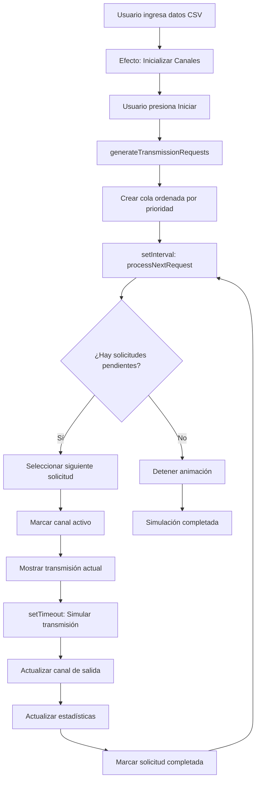

# Front-End del Simulador ATDM
## Funcionamiento de la Interfaz de Multiplexación Asíncrona

---

## 📋 Tabla de Contenidos

1. [Arquitectura General](#arquitectura-general)
2. [Componentes Principales](#componentes-principales)
3. [Gestión de Estado](#gestión-de-estado)
4. [Flujo de Animación](#flujo-de-animación)
5. [Interacción del Usuario](#interacción-del-usuario)
6. [Renderizado Visual](#renderizado-visual)

---

## Arquitectura General

El front-end del simulador ATDM está construido con **React** sin JSX (usando `React.createElement`), lo que permite ejecutarlo directamente en el navegador mediante Babel standalone.

### Estructura de Archivos

```
/views/asynchronous/
  └── atdm.html              # Página HTML principal
/js/
  └── atdm-animation.js      # Componentes React de visualización
```

### Stack Tecnológico

- **React 18**: Framework de UI para componentes reactivos
- **GSAP**: Animaciones avanzadas y transiciones suaves
- **Font Awesome**: Iconografía moderna
- **CSS Custom Properties**: Sistema de temas (modo claro/oscuro)

---

## Componentes Principales

El front-end se organiza en **9 componentes React** especializados:

### 1. `ATDMApp()` - Componente Raíz

**Función**: Orquesta toda la aplicación y gestiona el estado global.

**Responsabilidades**:
- Inicialización de canales de transmisión
- Control del ciclo de vida de la animación
- Coordinación entre MUX y DEMUX (conceptuales)
- Gestión de estadísticas en tiempo real

```javascript
function ATDMApp() {
    // Estados principales
    const [numChannels, setNumChannels] = useState(4);
    const [animationSpeed, setAnimationSpeed] = useState(1000);
    const [inputData, setInputData] = useState('JAHIR,EDWIN,ALEXIS,MONTSE');
    const [channels, setChannels] = useState([]);
    const [animationRunning, setAnimationRunning] = useState(false);
    const [transmissionQueue, setTransmissionQueue] = useState([]);
    // ... más estados
}
```

**Hooks utilizados**:
- `useState`: Manejo de 14 estados diferentes
- `useEffect`: 3 efectos para sincronización
- `useRef`: Referencias a intervalos de animación
- `useCallback`: Optimización de funciones de control

---

### 2. `AsyncIndicator()` - Indicador de Modo Asíncrono

**Función**: Muestra visualmente el estado actual del sistema.

**Props**:
- `isActive` (boolean): Si la transmisión asíncrona está activa

**Visualización**:
- 🟢 **MODO ASÍNCRONO ACTIVO**: Durante transmisión
- ⚪ **MODO EN ESPERA**: Sistema inactivo

```javascript
function AsyncIndicator({ isActive }) {
    return React.createElement('div', { className: 'async-indicator' },
        React.createElement('h3', {},
            isActive ? '🟢 MODO ASÍNCRONO ACTIVO' : '⚪ MODO EN ESPERA'
        ),
        React.createElement('p', {},
            isActive
                ? 'Los canales transmiten cuando tienen datos disponibles'
                : 'Presiona "Iniciar" para comenzar la transmisión asíncrona'
        )
    );
}
```

---

### 3. `RequestQueue()` - Cola de Solicitudes

**Función**: Visualiza todas las solicitudes de transmisión pendientes y en proceso.

**Props**:
- `requests` (Array): Lista de solicitudes generadas
- `processingRequest` (Object): Solicitud actualmente procesándose

**Lógica de Visualización**:
```javascript
requests.map((request, index) =>
    React.createElement('div', {
        className: `queue-item ${
            request.id === processingRequest?.id ? 'processing' :
            request.completed ? 'completed' : ''
        }`
    },
        React.createElement('span', { className: 'request-channel' }, `C${request.channel + 1}`),
        React.createElement('span', { className: 'request-data' }, request.data),
        request.id === processingRequest?.id &&
            React.createElement('i', { className: 'fas fa-spinner fa-spin' })
    )
)
```

**Estados de Solicitud**:
- **Pendiente**: Sin clases adicionales (gris)
- **Procesando**: `.processing` + spinner animado
- **Completada**: `.completed` (tachada)

---

### 4. `ATDMInputChannels()` - Canales de Entrada

**Función**: Muestra los canales de entrada con sus datos originales.

**Props**:
- `channels` (Array): Lista de objetos con información de canal
- `activeChannel` (number): Canal actualmente transmitiendo (-1 si ninguno)

**Estructura de Canal**:
```javascript
{
    id: 1,
    data: 'JAHIR',
    transmittedData: '',
    pendingRequests: 5,
    transmissions: 0
}
```

**Indicadores Visuales**:
- **Número de canal**: Identificador visual
- **Datos**: Texto a transmitir
- **Solicitudes Pendientes**: Conteo en tiempo real
- **Estado Activo**: Clase `.active` cuando está transmitiendo

---

### 5. `ATDMMultiplexer()` - Visualización del Multiplexor

**Función**: Representación visual del componente MUX que procesa solicitudes.

**Props**:
- `isActive` (boolean): Si está procesando datos
- `currentChannel` (number): Canal siendo procesado

**Elementos Visuales**:
```javascript
React.createElement('div', { className: 'mux-icon' }, '⚡'),
React.createElement('div', { className: 'mux-label' }, 'MUX'),
React.createElement('div', { className: 'mux-status' },
    isActive
        ? `C${currentChannel + 1} (ATDM)`
        : 'Asíncrono'
)
```

**Animaciones**:
- Pulso en el núcleo cuando está activo
- Indicador de flujo de señal animado

---

### 6. `ATDMFrameVisualization()` - Transmisión Actual

**Función**: Muestra los detalles de la transmisión en curso.

**Props**:
- `currentTransmission` (Object): Datos de la solicitud activa

**Información Mostrada**:
- Canal origen
- Dato siendo transmitido
- Prioridad de la solicitud (Alta/Normal)

```javascript
React.createElement('div', {},
    `Canal ${currentTransmission.channel + 1}: "${currentTransmission.data}"`
),
React.createElement('div', {},
    `Tipo: ${currentTransmission.priority === 'high' ? 'Alta Prioridad' : 'Prioridad Normal'}`
)
```

---

### 7. `ATDMDemultiplexer()` - Visualización del Demultiplexor

**Función**: Representación visual del DEMUX que distribuye datos.

**Props**:
- `isActive` (boolean): Si está distribuyendo datos
- `currentChannel` (number): Canal receiving data

**Funcionamiento**: Idéntico al multiplexor pero representa el extremo receptor.

---

### 8. `ATDMOutputChannels()` - Canales de Salida

**Función**: Muestra los datos reconstruidos en cada canal de salida.

**Props**:
- `channels` (Array): Canales con datos transmitidos
- `activeChannel` (number): Canal actualmente recibiendo

**Visualización**:
- **Datos Transmitidos**: Acumulación de caracteres recibidos
- **Conteo de Transmisiones**: Total de paquetes recibidos
- **Estado de Recepción**: Clase `.receiving` cuando está activo

```javascript
React.createElement('div', { className: 'output-data' },
    channel.transmittedData || 'Sin datos transmitidos'
),
React.createElement('div', {},
    channel.transmissions > 0
        ? `${channel.transmissions} transmisiones completadas`
        : 'Sin transmisiones'
)
```

---

### 9. `ATDMStatsPanel()` - Panel de Estadísticas

**Función**: Muestra métricas en tiempo real de la simulación.

**Props**:
- `stats` (Object): Objeto con métricas

**Métricas Visualizadas**:

| Métrica | Icono | Descripción |
|---------|-------|-------------|
| Total Solicitudes | 📋 | Requests generadas al inicio |
| Procesadas | ✅ | Transmisiones completadas |
| En Cola | ⏳ | Pendientes de procesar |
| Eficiencia | 💎 | % de completitud |

```javascript
const statItems = [
    { key: 'totalRequests', label: 'Total Solicitudes', icon: '📋', color: 'primary' },
    { key: 'processedRequests', label: 'Procesadas', icon: '✅', color: 'success' },
    { key: 'queueSize', label: 'En Cola', icon: '⏳', color: 'warning' },
    { key: 'efficiency', label: 'Eficiencia', icon: '💎', color: 'accent' }
];
```

---

## Gestión de Estado

### Estados Principales

El componente `ATDMApp` gestiona **14 estados React**:

#### Configuración
```javascript
const [numChannels, setNumChannels] = useState(4);        // 2-8 canales
const [animationSpeed, setAnimationSpeed] = useState(1000); // 500-3000ms
const [inputData, setInputData] = useState('...');         // Datos CSV
const [soundEnabled, setSoundEnabled] = useState(true);    // Audio (futuro)
```

#### Canales
```javascript
const [channels, setChannels] = useState([]);
// Estructura: [{ id, data, transmittedData, pendingRequests, transmissions }]
```

#### Control de Animación
```javascript
const [animationRunning, setAnimationRunning] = useState(false);
const [animationPaused, setAnimationPaused] = useState(false);
```

#### Cola de Transmisión
```javascript
const [transmissionQueue, setTransmissionQueue] = useState([]);
// Estructura: [{ id, channel, data, priority, completed, timestamp }]
```

#### Estado Actual
```javascript
const [processingRequest, setProcessingRequest] = useState(null);
const [currentTransmission, setCurrentTransmission] = useState(null);
const [activeChannel, setActiveChannel] = useState(-1);
```

#### Historial y Métricas
```javascript
const [transmissions, setTransmissions] = useState([]);
const [stats, setStats] = useState({
    totalRequests: 0,
    processedRequests: 0,
    queueSize: 0,
    efficiency: 100
});
```

---

### Inicialización de Canales

**Efecto de React** que se ejecuta al cambiar número de canales o datos de entrada:

```javascript
useEffect(() => {
    const dataParts = inputData.split(',').map(d => d.trim().substring(0, 8));
    const newChannels = Array.from({ length: numChannels }, (_, i) => ({
        id: i + 1,
        data: dataParts[i] || `DATA${i + 1}`,
        transmittedData: '',
        pendingRequests: 0,
        transmissions: 0
    }));
    setChannels(newChannels);
}, [numChannels, inputData]);
```

**Comportamiento**:
1. Parsea datos CSV
2. Limita cada dato a 8 caracteres
3. Crea array de canales
4. Asigna datos o valores por defecto

---

## Flujo de Animación

### 1. Generación de Solicitudes

**Función**: `generateTransmissionRequests()`

```javascript
const generateTransmissionRequests = useCallback(() => {
    const requests = [];

    channels.forEach((channel, index) => {
        if (channel.data && channel.data.length > 0) {
            // Cada caracter = 1 solicitud
            for (let i = 0; i < channel.data.length; i++) {
                requests.push({
                    id: `req-${index}-${i}`,
                    channel: index,
                    data: channel.data[i],
                    priority: Math.random() > 0.7 ? 'high' : 'normal',
                    completed: false,
                    timestamp: Date.now() + Math.random() * 5000
                });
            }
        }
    });

    // Ordenar por prioridad y timestamp
    requests.sort((a, b) => {
        if (a.priority === 'high' && b.priority !== 'high') return -1;
        if (a.priority !== 'high' && b.priority === 'high') return 1;
        return a.timestamp - b.timestamp;
    });

    setTransmissionQueue(requests);
    // ... actualizar estadísticas
}, [channels, numChannels]);
```

**Lógica**:
- Convierte cada carácter en una solicitud independiente
- Asigna prioridad aleatoria (30% alta, 70% normal)
- Ordena por prioridad primero, luego por timestamp

---

### 2. Procesamiento de Solicitudes

**Función**: `processNextRequest()`

```javascript
const processNextRequest = useCallback(() => {
    const pendingRequests = transmissionQueue.filter(req => !req.completed);

    if (pendingRequests.length === 0) {
        // Finalizar animación si no hay más solicitudes
        setAnimationRunning(false);
        return;
    }

    const nextRequest = pendingRequests[0];
    setProcessingRequest(nextRequest);
    setCurrentTransmission(nextRequest);
    setActiveChannel(nextRequest.channel);

    // Simular tiempo de transmisión
    setTimeout(() => {
        // Marcar como completada
        setTransmissionQueue(prev =>
            prev.map(req =>
                req.id === nextRequest.id ? { ...req, completed: true } : req
            )
        );

        // Actualizar canal de salida
        setChannels(prevChannels =>
            prevChannels.map((channel, index) => {
                if (index === nextRequest.channel) {
                    return {
                        ...channel,
                        transmittedData: (channel.transmittedData || '') + nextRequest.data,
                        transmissions: channel.transmissions + 1,
                        pendingRequests: Math.max(0, channel.pendingRequests - 1)
                    };
                }
                return channel;
            })
        );

        // Actualizar estadísticas
        setStats(prev => {
            const newProcessed = prev.processedRequests + 1;
            const remaining = prev.totalRequests - newProcessed;
            const efficiency = Math.round((newProcessed / prev.totalRequests) * 100);

            return {
                ...prev,
                processedRequests: newProcessed,
                queueSize: remaining,
                efficiency
            };
        });

        // Limpiar estado actual
        setProcessingRequest(null);
        setCurrentTransmission(null);
        setActiveChannel(-1);
    }, animationSpeed);
}, [transmissionQueue, animationSpeed]);
```

**Pasos del Proceso**:
1. **Seleccionar**: Primera solicitud pendiente
2. **Marcar activa**: Actualizar estados visuales
3. **Simular transmisión**: `setTimeout` con velocidad configurable
4. **Actualizar destino**: Añadir dato al buffer de salida
5. **Actualizar métricas**: Incrementar contadores
6. **Limpiar**: Resetear estados de transmisión

---

### 3. Control del Loop de Animación

**Efecto de React** que gestiona el intervalo:

```javascript
useEffect(() => {
    if (animationRunning && !animationPaused) {
        animationInterval.current = setInterval(processNextRequest, animationSpeed);
    } else {
        if (animationInterval.current) {
            clearInterval(animationInterval.current);
        }
    }

    return () => {
        if (animationInterval.current) {
            clearInterval(animationInterval.current);
        }
    };
}, [animationRunning, animationPaused, animationSpeed, processNextRequest]);
```

**Funcionamiento**:
- Crea `setInterval` solo si está corriendo y no pausado
- Limpia intervalo al pausar/detener
- Cleanup automático al desmontar componente

---

## Interacción del Usuario

### Controles Disponibles

#### 1. **Iniciar / Detener**

```javascript
const startAnimation = useCallback(() => {
    if (animationRunning && !animationPaused) return;

    if (animationPaused) {
        setAnimationPaused(false);
        return;
    }

    // Generar solicitudes de transmisión
    const requests = generateTransmissionRequests();

    if (requests.length === 0) {
        alert('No hay datos para transmitir.');
        return;
    }

    setAnimationRunning(true);
    setAnimationPaused(false);
    setTransmissions([]);
}, [animationRunning, animationPaused, generateTransmissionRequests]);

const stopAnimation = useCallback(() => {
    setAnimationRunning(false);
    setAnimationPaused(false);
    setProcessingRequest(null);
    setCurrentTransmission(null);
    setActiveChannel(-1);
}, []);
```

**Comportamiento**:
- **Iniciar**: Genera cola y comienza procesamiento
- **Detener**: Pausa inmediatamente y limpia estados activos
- **Reanudar**: Si está pausado, continúa desde donde quedó

---

#### 2. **Pausar**

```javascript
const pauseAnimation = useCallback(() => {
    if (!animationRunning || animationPaused) return;
    setAnimationPaused(true);
}, [animationRunning, animationPaused]);
```

**Comportamiento**: Mantiene el estado pero detiene el procesamiento

---

#### 3. **Reiniciar**

```javascript
const resetAnimation = useCallback(() => {
    stopAnimation();
    setTransmissionQueue([]);
    setProcessingRequest(null);
    setCurrentTransmission(null);
    setActiveChannel(-1);
    setTransmissions([]);
    setStats({
        totalRequests: 0,
        processedRequests: 0,
        queueSize: 0,
        efficiency: 100
    });

    // Resetear canales
    setChannels(prevChannels =>
        prevChannels.map(channel => ({
            ...channel,
            transmittedData: '',
            pendingRequests: 0,
            transmissions: 0
        }))
    );
}, [stopAnimation]);
```

**Comportamiento**: Limpia todo y vuelve al estado inicial

---

### Configuración Dinámica

#### Sliders

**Número de Canales (2-8)**:
```javascript
React.createElement('input', {
    type: 'range',
    min: '2',
    max: '8',
    value: numChannels,
    className: 'slider-modern',
    onChange: (e) => {
        setNumChannels(parseInt(e.target.value));
        resetAnimation(); // Limpia simulación al cambiar
    }
})
```

**Velocidad de Transmisión (500-3000ms)**:
```javascript
React.createElement('input', {
    type: 'range',
    min: '500',
    max: '3000',
    step: '100',
    value: animationSpeed,
    className: 'slider-modern',
    onChange: (e) => setAnimationSpeed(parseInt(e.target.value))
})
```

---

#### Entrada de Datos

**Textarea para CSV**:
```javascript
React.createElement('textarea', {
    className: 'data-input-modern',
    value: inputData,
    onChange: (e) => setInputData(e.target.value),
    placeholder: 'Canal1,Canal2,Canal3,Canal4'
})
```

**Procesamiento**:
- Separa por comas
- Trimea espacios
- Limita a 8 caracteres por canal
- Canales sin datos usan valor por defecto

---

## Renderizado Visual

### Sistema de Clases CSS

El front-end utiliza **clases dinámicas** basadas en el estado:

#### Estados de Canal
```javascript
className: `channel-card ${activeChannel === index ? 'active' : ''}`
```

#### Estados de Solicitud
```javascript
className: `queue-item ${
    request.id === processingRequest?.id ? 'processing' :
    request.completed ? 'completed' : ''
}`
```

#### Estados de Componentes MUX/DEMUX
```javascript
className: `mux-core ${isActive ? 'active' : ''}`
```

---

### Animaciones CSS

**Activadas automáticamente** mediante clases:

- `.active`: Pulso y brillo en canales activos
- `.processing`: Spinner giratorio en solicitudes
- `.receiving`: Efecto de recepción en canales de salida
- `.wave-indicator`: Ondas animadas en canales de entrada

**Librerías utilizadas**:
- **GSAP**: Para animaciones complejas (potencial futuro)
- **Animate.css**: Para efectos predefinidos
- **CSS Transitions**: Para cambios de estado suaves

---

### Layout Responsive

**Estructura principal**:
```
app-container
├── app-header
└── main-layout
    ├── control-sidebar (Panel de configuración)
    └── visualization-main (Área de animación)
        ├── AsyncIndicator
        ├── RequestQueue
        ├── ATDMInputChannels (Grid)
        ├── ATDMMultiplexer
        ├── ATDMFrameVisualization
        ├── ATDMDemultiplexer
        └── ATDMOutputChannels (Grid)
```

**Grids utilizados**:
- `input-channels-grid`: Display flexible para canales de entrada
- `output-channels-grid`: Display flexible para canales de salida
- `stats-grid`: Grid de 4 columnas para métricas

---

## Flujo de Datos Completo

### Diagrama de Flujo



---

## Características Clave del Front-End

### 1. **Asincronía Real**
- No depende del modelo/simulador (ATDMSimulator.js)
- Implementa su propia lógica de cola y priorización
- Procesamiento visual independiente

### 2. **Reactividad Total**
- Todo cambio de estado se refleja instantáneamente
- Uso eficiente de `useCallback` para evitar re-renders
- Efectos sincronizados con `useEffect`

### 3. **Escalabilidad**
- Soporta 2-8 canales sin degradación
- Velocidades configurables en tiempo real
- Manejo eficiente de colas grandes

### 4. **Feedback Visual Rico**
- 9 componentes especializados
- Indicadores de estado en tiempo real
- Animaciones fluidas y profesionales

### 5. **Control Granular**
- Iniciar/Pausar/Detener/Reiniciar
- Configuración en caliente
- Sin pérdida de datos al configurar

---

## Diferencias con el Modelo (ATDMSimulator.js)

| Aspecto | Front-End | Modelo |
|---------|-----------|--------|
| **Propósito** | Visualización y UX | Lógica de multiplexación |
| **Procesamiento** | Solicitud por solicitud | Trama completa |
| **Priorización** | Alta/Normal aleatoria | Round-robin de buffers |
| **Direccionamiento** | No implementado visualmente | Bits binarios calculados |
| **Eficiencia** | % de completitud | Slots usados vs. disponibles |
| **Cola** | Array de solicitudes | Buffers por canal |

**Nota**: El front-end es una **representación educativa** del comportamiento asíncrono, mientras que el modelo implementa la **lógica técnica real** de ATDM.

---

## Tecnologías y Patrones

### Patrones de React Utilizados

1. **Composición de Componentes**: 9 componentes modulares
2. **Lifting State Up**: Estado centralizado en `ATDMApp`
3. **Controlled Components**: Inputs controlados por estado
4. **Custom Hooks**: `useCallback` para optimización
5. **Effect Hooks**: Sincronización de animaciones
6. **Conditional Rendering**: UI dinámica basada en estado

### Optimizaciones

- **useCallback**: Previene recreación de funciones
- **Batched Updates**: React agrupa cambios de estado
- **Memoization**: Evita cálculos redundantes
- **Cleanup Effects**: Limpieza de intervalos al desmontar

---

## Conclusión

El front-end del simulador ATDM es una **aplicación React moderna** que implementa:

✅ **Gestión compleja de estado** con 14 estados sincronizados  
✅ **Animación fluida** mediante intervalos y timeouts controlados  
✅ **Visualización educativa** de conceptos de multiplexación asíncrona  
✅ **Interactividad total** con configuración en tiempo real  
✅ **Arquitectura modular** con componentes reutilizables  
✅ **Feedback visual rico** para comprensión intuitiva  

El diseño permite a los usuarios **experimentar visualmente** cómo funciona la multiplexación asíncrona, viendo en tiempo real cómo se priorizan y procesan las solicitudes de transmisión de múltiples canales.
